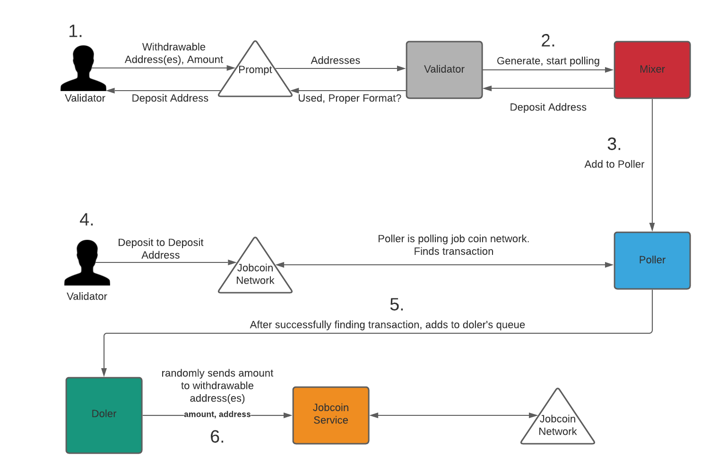
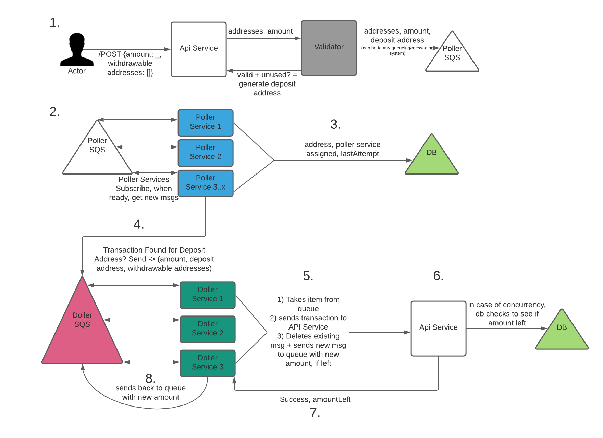
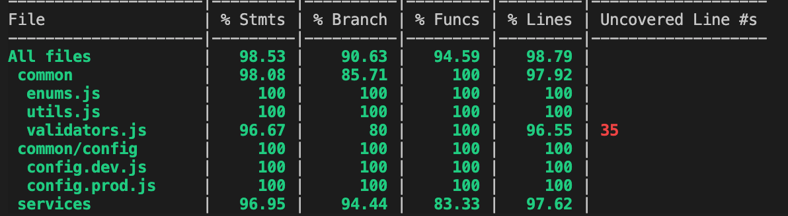

# Job Coin Mixer

A project to anonymize the sending of crypto-coin transactions (JobCoin) by mixing them together. Mixer allows you to anonymize the transactions occurring on your wallets.

## Running Project
1. `npm install`
2. `npm start`

## Architecture
### Current Architecture
The current architecture diagram for this project also stored under the root github repo called `current-architecture.png`

The project is split into multiple core services (mixer, poller, doler, and the job coin api client)

- Mixer: The mixer is essentially the entry point of the service. It creates an instance of the poller and doler. It generates new deposit addresses (and makes sure that the address is truly unused), and adds items to be polled and dole'd. 
- Poller: Once the mixer adds in an item to begin polling, it asynchronously starts polling to see if there have been any transactions on the address. By making the calls asynchronously it supports polling multiple deposit addresses at once. Once polling is successful it uses the call back function that the mixer provides to notify the mixer that it is time to send it over to the doler.
- Doler: Once an item gets added to the doler's queue (simple list for now), it starts sending money from the house account to the withdrawal addresses over time. The way it does this is it takes the first item from the queue, distributes a fraction of the total remaining amount to one of the withdrawal addresses, and if there's still an amount remaining it adds it back to the queue. This easily supports multiple separate transactions running at a time, and multiple different withdrawal addresses. There were a few decisions I made inside the Doler: a) Fee Percentage. For now I took an amount based fee percentage approach where it takes a higher fee percentage if the amount is lower. B) Randomness: I wanted to make the sending of the transactions and picking which withdrawal address completely random each time.
- Job Coin Api Client: Simple api client to request from our job coin network

### Ideal Architecture
I also took time to write out the ideal architecture for this project if developing it for a production level application. There are a few decisions made here that I will go into detail below. Png can be found inside root level of repo under `ideal-architecture.png`

1. As the first step the actor would post to our API Service with the amount they want to mi and the withdrawable addresses. The API Service would validate the address + amount, generate an unused deposit address and send this info: `{depositAddress: string, amount: float, withdrawableAddresses: array of strings}` to a persistent messaging/queueing service (in this example AWS SQS)
2. We would have multiple (upto x) poller services that are subscribed to the queueing system, each of these services could have a limit of concurrent polling actions they can handle, and if available take from the queue to handle more. Once taken from the Queue store in our DB what they are queueing. 
3. The reason I believed a DB would be good to have is in case any of the Poller Services go down. The DB could be used to re-add the addresses previously assigned to the service, or could even be used to re-distribute based on lastAttempt date to the services that are alive.
4. Once api service returns back success that address has been deposited to, it would send it to the doler queuee with info of `{amount, deposit address, withdrawable address}`
5. Doller Queue would also have multiple doller services that it would subscribe to, to take messages to transact. It would first:
    1. Take item from the queue.
    2. Send transaction to API Service.
    3. Once API Service comes back as success (with new amount left), delete current msg from queue, and add back new one with new amount left. This has a lot of benefits: keeps architecture super clean, add's more randomness as to when next transaction will come, and allows for retries, etc.
6. API Service when receiving a transaction to send would be given: `{amount: _, withdrawableAddresses: []}`. API Service would be responsible for deducting a fee (could be at random, could be based on amountLeft, or we could also provide deposit address if it's user level specific (premium users, etc)). It would then update the DB with this information. The database is useful because we could handle concurrent issues. Imagine we want to scale it up and add multiple messages to queue to handle multiple transactions for same deposit address at once. The DB Could add a lock to the amount left, and until first service is done processing does not proceed second service. The initial amount entry is the one used from Queue, but after that the API Service could query against the withdrawable addresses/deposit address to see what the true amount left is. Not necessary, but an extra easy tool to add from beginning in case this is a necessity down the line.
7. If API Service returns error, can retry (add back to queue or retry on spot), otherwise returns success + amount left.
8. If amount left > 0, adds back to queue

## Testing

For now only included unit tests. Later on can work on integration testing as well.

### Running tests
1. `npm install`
2. `npm test`

### Code Coverage

This was written with TDD in mind, so the code coverage is at > 90% for all branches, lines, and functions. Later on we can include this as part of our CI/CD pipelines.

## Project Structure
`index` - Main entrypoint to application. Creates instance of the mixer client, and lets the mixer client do most of the work.

`common` - Directory that includes all files needed across project or services such as validators, logging, enums, configs, and other utilities.

`services` - includes core services used by the project such as mixer, doler, poller, and jobCoinApiClient

`tests` - all tests go here and end with spec.js

## Logging & Config
For config I used loDash to create one config.js main object, and different dev and prod. The great thing about this is config.js is the baseLine, for example if there are variables shared between dev and prod instead of writing it twice you can just write it inside config.js

For logging I used winston logging and for now stored messages inside the console. Later on can add loggly/cloudwatch/any other logging service pretty easily with winston.

## Assumptions and notes
I took multiple assumptions while writing this MVP, and have other general notes. I have listed these below:

1. More than one withdrawable address is always required. I read in the requirements 'addresses' so assumed that was necessary (also makes sense so transactions are more anonymized)
2. Assummed that we would not want to be polling forever. If it's been 6 months and there still have been no transactions, we should stop polling. I also added in a 'factor' to the polling so that each subsequent poll after the first would be exponential. (On config I set factor to 1, but can easily be increased)
3. I assumed the Poller only cares about the first transaction. After the first transaction is detected it automatically starts dol'ing out the money. Alternatively, if we needed to forever poll the deposit address the implementation would be a bit different. Really we could just keep the message inside the poller for each subsequent transaction check.
4. One way I could have easily sped up the current implementation with the doler is to group together multiple transactions into promises. For now kept it as one transaction at a time.
5. One more thing I could have done inside the doller was to use the `lastWithdrawalDate`. If current date is too close to the `lastWithdrawalDate` we could have added it back to the doler queue to add a little bit of delay and add in more of the 'over time' requirement.